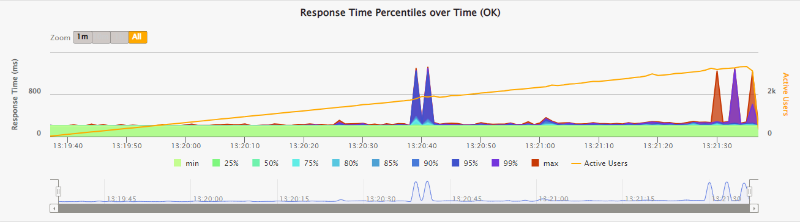

# Virtual Thread Demonstrator

This repository contains code and deployment scrips for performance test environment that compares the performance
of a web application using classic platform threads.

## Test Environment

The environment consists of the following components.

- Delay Service representing an external to the application under test service that it calls using blocking IO.
- Sync Service is an application under test that can be launched in either platform or virtual thread mode.
  This application accepts requests, forwards them to Delay Service using blocking IO, and forwards back the response.
- Gatling Test Suite implementing a test scenario where a stream of requests with linearly increasing QPS is sent
  to the application under test.

To ensure that no other component of the environment except the application under test represents a bottleneck,
more powerful hardware should be used for Delay Service and Gatling Test Suite. The Delay Service can be deployed
either behind a load balancer or on a machine with significantly better specifications that the one used
for Sync Service.


## Components Configuration

The test environment can be deployed on AWS EC2 instances. This will ensure identical system specifications between
benchmark runs with the only difference being the type of threads used by the application under test.

### Sync Service

- EC2 t3.micro
- Spring Boot 3.1.1 WebMvc

### Delay service

- 3 EC2 t3.micro behind an application load balancer (option 1)
- EC2 t3.xlarge or better (option 2, Note: JVM memory configuration should be set appropriately in
  the [Delay Service unit file](ops-tools/service/delay.service) to take advantage of all the available RAM)
- Spring Boot 3.1.1 WebFlux

### Gatling Test Suite

- EC2 t3.xlarge or better
- Gatling 3.9

## Deployment

- To minimize network latency, all instances should be created in the same subnet.
- [Components Installation instructions](ops-tools/README.md)

## Running performance test

- `ssh` into the Gatling Test Suite instance
- clone this repository
- run the benchmark as described in [performance-tests/README.md](performance-tests/README.md)
- copy the report from the Gatling Test Suite instance using `scp` \
  Example:
  ```shell
  scp -i "aws-key.pem" -r ec2-user@ec2-16-171-115-121.eu-north-1.compute.amazonaws.com:~/virtual-thread-demonstrator/performance-tests/build/reports/gatling gatling
  ```

## Test Results

The following are the example performance test results for virtual and platform thread modes when run with described
configuration of the test environment. The load scenario used to produce the results was to gradually increase load
on the application under test from 10 QPS to 2800 QPS over 120 seconds.

### Platform Threads


### Virtual Threads


